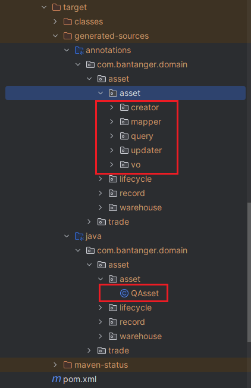
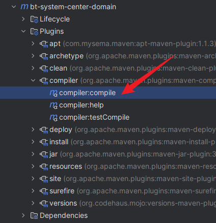
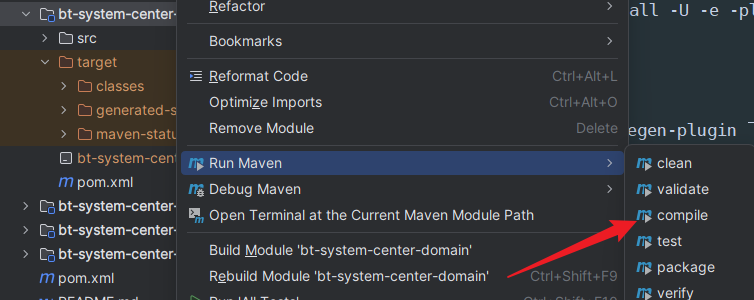
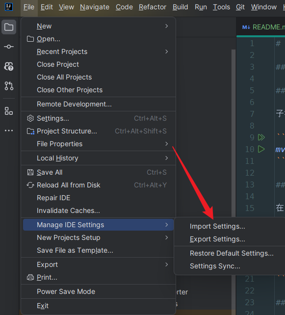
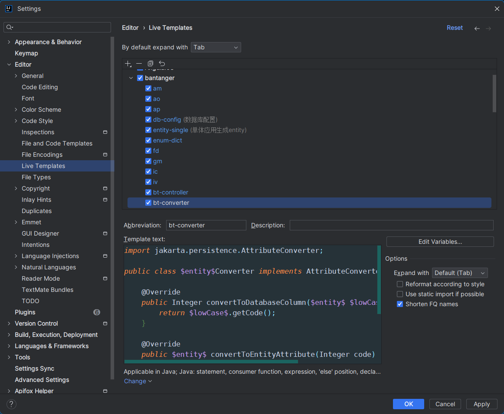

# Persevere

## 领域服务文章概览

- [订单领域](bt-system-center/bt-system-center-domain/src/main/java/com/bantanger/domain/trade/order/订单领域.md)
- [交易领域](bt-system-center/bt-system-center-domain/src/main/java/com/bantanger/domain/trade/交易领域.md)
- [支付领域](bt-system-center/bt-system-center-domain/src/main/java/com/bantanger/domain/pay/支付领域.md)
- [资产领域](bt-system-center/bt-system-center-domain/src/main/java/com/bantanger/domain/asset/资产领域.md)
- [消息中心](bt-system-center/bt-system-center-domain/src/main/java/com/bantanger/domain/message/消息领域.md)

## 通用学习文章

[ClassLoader学习.md](bt-practise/elegant-practise/ClassLoader学习.md)

[优雅编程.md](bt-practise/elegant-practise/优雅编程.md)

[业务扩展点.md](bt-common-starters/bt-extension-spring-boot-starter/业务扩展点.md)

## 注意事项

### 环境版本

jdk17

### 代码生成器

子模块 bt-codegen-plugin 下的 codegen-apt 为代码生成器，使用时请先安装该模块。

```shell
mvn clean install -U -e -pl bt-codegen-plugin\codegen-apt
```

### 代码生成

在引入了 bt-codegen-plugin 下的 codegen-apt 依赖的 module 模块中，运行 maven 插件生成代码。

> 本项目可以在 bt-system-center 下的 bt-system-center-domain 模块中进行体验

```shell
mvn clean compile -U -e -pl bt-system-center\bt-system-center-domain
```

如果是跨子模块生成 controller、api。可能执行时会报错：找不到 xx 依赖，这时需要在 api 子模块下执行 install 命令。
因为 domain 子模块引用了 api 子模块，所以需要先 install api 子模块。

---

一定要编译执行成功，因为 querydsl 需要编译出来的 Q 类

编译成功的 target 应该如下：



**对于命令行执行会报错的**

解决方案一: 在 IDEA 右侧执行 Maven 插件 plugin compiler:compiler。



解决方案二: 在 IDEA 中右键点击 module -> Maven -> Generate Sources and Update Folders

解决方案三: 在 IDEA 中右键点击 module -> Run Maven -> compile



### Live Templates (IDEA) 导入

Manage IDE Settings -> Import Settings -> 选择本项目的 settings.zip 



具体命令可在 live templates 中查看。

