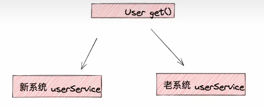
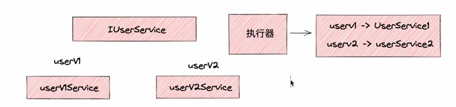

# 业务扩展点

业务扩展点可以作为系统扩展的一个轻量实现，能在基本不改变代码的情况下，进行系统的动态扩展。

条件的封装可以使用StepBuilder 进行设计，StepBuilder 在QueryDsl，Elasticsearch 中使用的场景非常多。

[扩展点思想](https://u1utet4cta.feishu.cn/docx/QOundlJIgoD0u2xeqXCc2HYfnGd)

[xxxPostProcessor](https://u1utet4cta.feishu.cn/docx/AomKdxzOWoMtB8x17JDcZ8IDnXe)

## 场景

1.新老服务动态切换

通过远程配置中心设置 服务开关，开启 on 则调度新系统服务，关闭 off 则调度旧系统服务



2.流量切换

3.本地服务、远程服务动态切换

## 实现

实际上任何业务都可以抽象成有返回值和无返回值

本质上还是策略模式，需要把不同服务实现注册到配置类（或者叫执行器）中，就是 sceneId -> service 映射



更通用的一种设计:

参考 [spring plugin](https://github.com/spring-projects/spring-plugin/blob/main/README.markdown)

核心接口 Plugin 

```java
public interface Plugin<S> {

    /**
     * Returns if a plugin should be invoked according to the given delimiter.
     *
     * @param delimiter must not be {@literal null}.
     * @return if the plugin should be invoked
     */
    boolean supports(S delimiter);
}
```

通过实现暴露的 supports 接口来实现不同服务实现类的路由选择. 在很多框架设计中都有这种设计模式的思想: spring security

本框架 extension 的一个缺陷就是，判断不同服务实现类只能通过判断某 bizId 是否在 map 里。

而 plugin 方式，实现 supports 接口，就可以支持更多的判断条件，比如判断某个参数是否为空，是否满足某个条件等..

