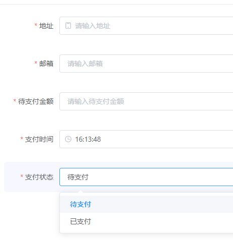

## 如何理解领域服务

- 工作流：解决审批流程问题，只需要提交审批表单，中间一系列流程不需要 care，最终回返模板结果
- 规则引擎：判断条件的是或否，分流到不同的结果集里
- 注册中心：服务注册、服务发现，不需要我们手动维护服务的地址

这三个例子有什么共性？实际都是领域服务，我们在使用的时候将这三个服务当成了一个对象，我传入参数，返回结果，而不用关心流程处理

**领域服务，面向对象去思考，实际就是对现实的抽象。**

实际工作中，公司项目或个人项目，往往也都分出了一些有共识的域，如：

- 用户中心：用户注册、用户登录、用户信息修改、用户密码找回等
- 商品中心：商品上架、商品下架、商品查询、商品推荐等
- 仓储中心：库存查询、库存扣减、库存补充、库存预警等
- 交易中心：交易创建、交易支付、交易退款、交易查询等
- 订单中心：订单创建、订单支付、订单退款、订单查询等
- 支付中心：支付宝支付、微信支付、银联支付、代付款支付等
- 优惠券中心：优惠券领取、优惠券使用、优惠券查询等
- 通知中心：短信通知、邮件通知、站内信通知等

## 如何建模

> 现实世界：通过不同的属性来区分不同的对象
>
>   如用户有用户名、密码、手机号、邮箱等属性，商品有商品名、商品价格、商品库存等属性
>
> 对应领域建模：通过不同的对象来区分不同的领域
> 
>   如用户中心有用户对象、商品中心有商品对象、仓储中心有库存对象、交易中心有交易对象、订单中心有订单对象、支付中心有支付对象、优惠券中心有优惠券对象、通知中心有通知对象

**抽象对象的概念，我们可以用模板来描述不同的对象，或者可以理解成不同的表单描述不同的对象**

模板 - 对象

模板项 - 对象的属性

## 资料
- docker 使用文档：[https://bugstack.cn/md/road-map/docker.html](https://bugstack.cn/md/road-map/docker.html)
- DDD 教程；
  - [DDD 概念理论](https://bugstack.cn/md/road-map/ddd-guide-01.html)
  - [DDD 建模方法](https://bugstack.cn/md/road-map/ddd-guide-02.html)
  - [DDD 工程模型](https://bugstack.cn/md/road-map/ddd-guide-03.html)
  - [DDD 架构设计](https://bugstack.cn/md/road-map/ddd.html)
  - [DDD 建模案例](https://bugstack.cn/md/road-map/ddd-model.html)

一些文章:

- [What is JPA AggregateRoot?](https://www.baeldung.com/spring-persisting-ddd-aggregates)
- [@DomainEvents(spring.io)](https://docs.spring.io/spring-data/jpa/reference/repositories/core-domain-events.html)
- [DDD Bounded Contexts | DDD 界限上下文](https://www.baeldung.com/java-modules-ddd-bounded-contexts)