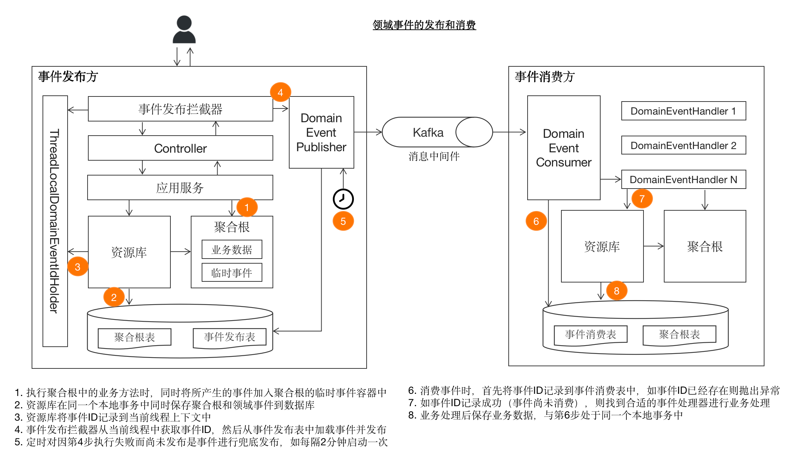

## 如何理解领域服务

- 工作流：解决审批流程问题，只需要提交审批表单，中间一系列流程不需要 care，最终回返模板结果
- 规则引擎：判断条件的是或否，分流到不同的结果集里
- 注册中心：服务注册、服务发现，不需要我们手动维护服务的地址

这三个例子有什么共性？实际都是领域服务，我们在使用的时候将这三个服务当成了一个对象，我传入参数，返回结果，而不用关心流程处理

**领域服务，面向对象去思考，实际就是对现实的抽象。**

实际工作中，公司项目或个人项目，往往也都分出了一些有共识的域，如：

- 用户中心：用户注册、用户登录、用户信息修改、用户密码找回等
- 商品中心：商品上架、商品下架、商品查询、商品推荐等
- 仓储中心：库存查询、库存扣减、库存补充、库存预警等
- 交易中心：交易创建、交易支付、交易退款、交易查询等
- 订单中心：订单创建、订单支付、订单退款、订单查询等
- 支付中心：支付宝支付、微信支付、银联支付、代付款支付等
- 优惠券中心：优惠券领取、优惠券使用、优惠券查询等
- 通知中心：短信通知、邮件通知、站内信通知等

## 如何建模

> 现实世界：通过不同的属性来区分不同的对象
>
>   如用户有用户名、密码、手机号、邮箱等属性，商品有商品名、商品价格、商品库存等属性
>
> 对应领域建模：通过不同的对象来区分不同的领域
> 
>   如用户中心有用户对象、商品中心有商品对象、仓储中心有库存对象、交易中心有交易对象、订单中心有订单对象、支付中心有支付对象、优惠券中心有优惠券对象、通知中心有通知对象

**抽象对象的概念，我们可以用模板来描述不同的对象，或者可以理解成不同的表单描述不同的对象**

模板 - 对象

模板项 - 对象的属性


## DDD概念

DDD 一个重要的使命是实现软件中“技术复杂度”与“业务复杂度”的解构分离。

为此，我们需要使用与产品、测试、技术RD都达成共识的**领域模型**来描述业务，使之与数据库、消息队列等技术实现解耦开来。

### 聚合根

在 DDD 的领域模型中，最重要、最核心的就是**聚合根（Aggregate Root）**。我们甚至可以认为整个 DDD 都是围绕聚合根的设计与实现展开的。

聚合根中的“聚合”即“高内聚，低耦合”中的“内聚”之意，而“根”则是“根部”的意思。

一个业务的核心模型，往往都是聚合根，如：

- 在一个电商系统中，一个订单（Order）对象表示一个聚合根 
- 在一个CRM系统中，一个客户（Customer）对象表示一个聚合根 
- 在一个银行系统中，一次交易（Transaction）对象表示一个聚合根

聚合根是业务逻辑执行的主要载体，但对于一些跨聚合的、需要访问技术基础设施的（如仓储层、中间件），还是需要领域服务（Domain Service）作为业务载体。

> 领域服务是聚合根自身无法完成业务逻辑时的代替品，是不得已而为之的一个概念

比如用户修改手机号，需要先检查该手机号是否已经在库里存在，这时就无法将业务逻辑放在聚合根对象里，因为涉及到扫表，会查出多个聚合根对象。因此这段逻辑会抽象到领域服务里实现。

### 实体与值对象

从更广义上讲，聚合根属于实体的范畴。在DDD中，存在**实体(Entity)** 和**值对象(Value Object)** 是一对相互对立的概念，
实体用于表示那些具有生命周期的“存在”，而值对象用于表示那些仅仅起描述性作用的东西。

**_实体通过唯一标识进行标定，而值对象则通过其包含的所有属性进行标定。_**

在编码实现时，最直观的区别则是实体对象有ID，而值对象没有ID；此外，实体对象一般包含比较复杂的业务逻辑，而值对象通常则是一些简单的小对象，业务逻辑相对简单。

举个常见的例子，无论一对双胞胎长得多么的相像，但由于两个人的身份证号不同（即ID不同），那么两人便属于不同的实体；
而对于货币来说，一张崭新的百元大钞和一张破旧的占满了细菌的百元大钞是可以等价交换的，因为他们所包含的属性值（均是100元）是一样，因此他们均属于值对象。

> 需要注意的是，虽然聚合根属于实体，但是实体却不只是包含聚合根。
> 事实上，聚合根隶属于实体，同时其内部又可以包含其他实体。
> 举个例子，汽车作为聚合根是一个实体，同时汽车内部的发动机也是一个实体，但发动机却不是聚合根。

### 领域工厂 Factory

有些对象（特别是聚合根）的创建过程本身也是业务逻辑的一部分，在DDD中，为了显式化业务逻辑，也为了遵从关注点分离的原则，我们将这些对象的构建过程封装到工厂(Factory)中。

参考：https://www.bilibili.com/video/BV1auVgzPEdt

**为什么需要 DDD 工厂？**

- 它能帮你隐藏那些繁琐的对象创建细节。 
- 最重要是，它能确保你创建出来的领域对象从一开始就是健康、有效、符合业务规则的！就像蛋糕店保证做出来的蛋糕能吃且好吃。 
- 它是你领域模型的一部分，让你的代码更贴近真实业务。

**工厂能“生产”什么？**

不只聚合！聚合、实体、值对象它都能造！只要这个对象的创建过程有点复杂，或者需要确保它生出来就是“对”的，就可以用工厂。

**对象安全怎么保证？**

限制领域对象的构造函数访问权限（private 或 protected），让工厂成为创建对象的唯一合法通道！
这样，你就能在工厂里把好质量关，把所有不符合规则的创建拒之门外。

--- 

一个聚合根的工厂对象如下：

```java
@Component
@RequiredArgsConstructor
public class MemberFactory {
    private final MemberRepository memberRepository;
    private final DepartmentRepository departmentRepository;

    public Member create(String name,
                         List<String> departmentIds,
                         String mobile,
                         String email,
                         String password,
                         User user) {

        //此处只为展示工厂类，省略了具体实现细节
        return create(name, departmentIds, mobile, email, password, null, user); 
    }
}
```

### 领域事件 Event

在DDD的领域模型中，一个业务操作通常会导致一个结果，这个结果被称为领域事件，即领域模型中已经发生的事情，比如“成员手机号已更新”便是一个领域事件。

领域事件通常用于组件之间的因果关系处理，比如当“成员手机号已更新”事件产生后，我们可能会在另一个业务组件中做相应的同步操作，这里的组件粒度可以是聚合根，可以是其他业务模块（下游），还可以是一个独立的第三方系统。

下图展示了领域事件的发布与消费



- 其实核心就是需要对领域事件做 outbox 事务性发布模型，当事件发布与消费之后，都需要持久化记录。加上定时扫表查出未发送或发送异常的事件进行重新发送（消费异常的通过MQ保证成功）

参考：
- https://www.bilibili.com/video/BV1RBV7z4EYT
- https://docs.mryqr.com/ddd-domain-events


## 参考文章

- [张逸-解构领域驱动设计(微信读书)](https://weread.qq.com/web/reader/4fc328a0729350754fc56d4#outline?noScroll=1)
- [腾云-DDD系列文章(五星推荐阅读!)](https://www.cnblogs.com/davenkin/tag/DDD/)
- [What is JPA AggregateRoot?](https://www.baeldung.com/spring-persisting-ddd-aggregates)
- ~~[@DomainEvents(spring.io)](https://docs.spring.io/spring-data/jpa/reference/repositories/core-domain-events.html)~~ 不推荐阅读了，Spring Domain Events 有坑，没有 outbox 机制，无法实现事件溯源
- [DDD Bounded Contexts | DDD 界限上下文](https://www.baeldung.com/java-modules-ddd-bounded-contexts)