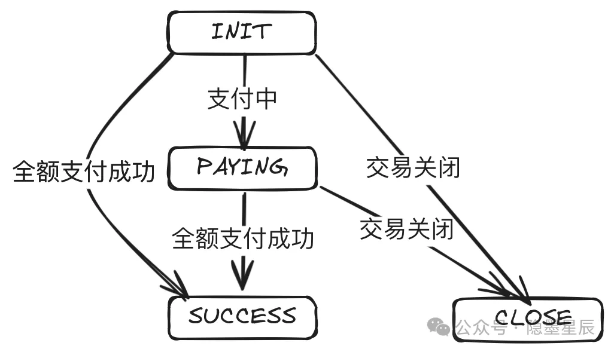
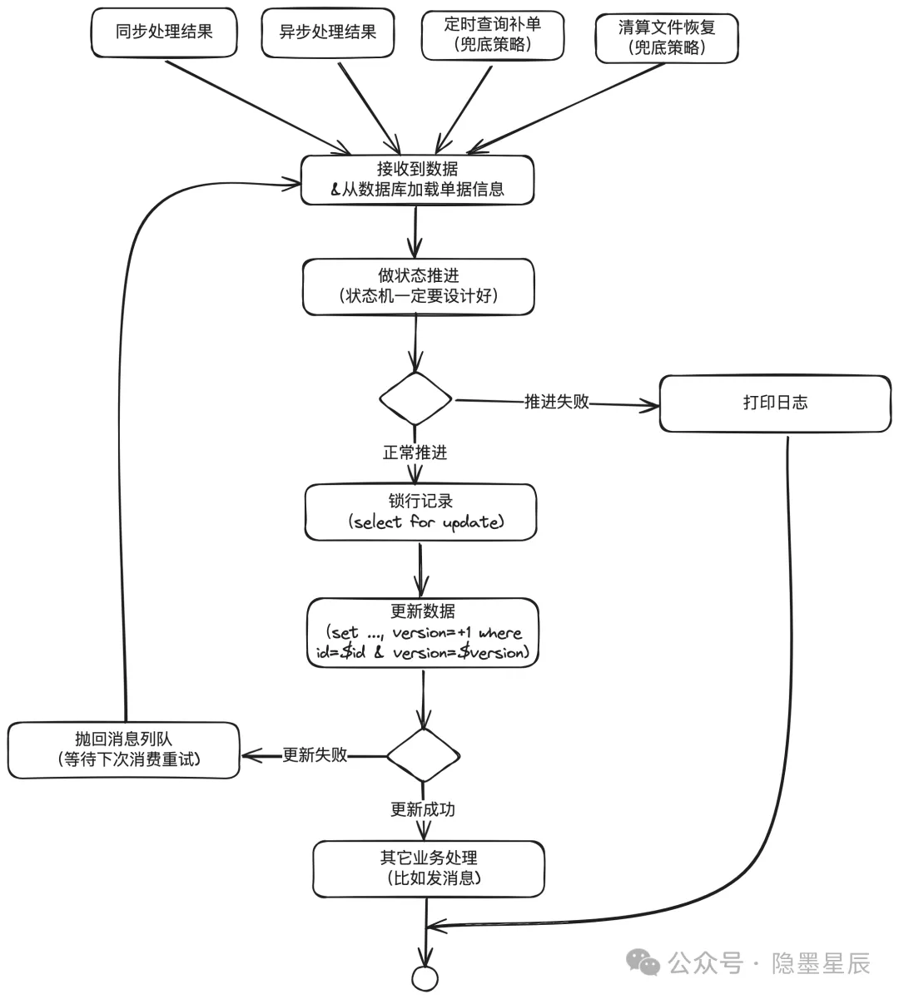

## 阅读
核心类：PaymentDomainService

## 状态机模型

## 并发更新问题：状态机领域模型被两个线程同时操作怎么保证状态幂等？

> 在分布式场景下这是个很常见的问题，同一机器可能会被多个线程处理同一笔业务，不同的机器也可能处理同一笔业务

**_业内通常的做法是设计良好的状态机 + 数据库锁 + 数据版本号解决。_**

1. 状态机一定要设计好状态和流转过程。只有特定的原始状态 + 特定的事件才可以推进到指定的状态。比如 INIT + 支付成功事件才能推进到 SUCCESS 状态
2. 为避免长事务，需要 select for update
3. 补偿机制兜底，查询补单、对账文件恢复等

参考：
https://mp.weixin.qq.com/s/NPWiM4dk9M9b8Griiw6GkQ