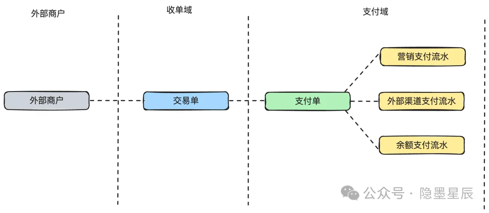

# 支付领域

常见问题：
1. 组合支付要不要拆流水
2. 查询要不要穿透到外部渠道
3. 为什么要做同步受理异步处理
4. 支付补偿怎么做
5. 如何防重复支付
6. 万一重复支付怎么办
7. 支付成功后用户关单怎么办
8. 支付要不要做系统重试
9. 支付渠道如何隔离
10. 支付资损防控怎么做
11. 支付路由怎么做
12. 多域之间实时两两对账怎么做
13. 超时自动取消与支付并发
14. 预支付

## 组合支付拆分流水

组合支付，指的是实际支付过程中，可以通过虚拟货币或优惠卷等方式进行部分交易抵扣

面向商户的是收单域 -> 生成交易单 -> 交易单下挂主支付单（面向系统其实是支付域）

一个主支付单下可以挂多个支付流水，一个支付方式就对应一条支付流水

由支付域来负责多个支付方式的组合，以及主支付单生命周期的推进

## 前端轮询

> 很多人喜欢直接把查询穿透到外部渠道，比如用户提交支付后，在收银台页面 loading，
> 收银台页面会有一个定时任务高频查询后端的支付结果，
> 这个查询请求链路：收银台页面 -> 收银台后端 -> 收单域 -> 支付域 -> 渠道网关域 -> 外部渠道。

实际解法：前端 Client 轮询收银台后端，后端只查缓存而不查实际支付的外部渠道。

这是因为一旦网络波动或外部渠道异常导致第三方接口超时，就会迅速的把收银台后端服务的线程数全部耗尽！（重试） 进而可能还会导致服务雪崩。

因此查询请求链路：收银台页面 -> 收银台后台 -> 查询缓存 <- 支付域（更新缓存）<- 第三方接口回调通知

## 支付状态补偿

支付请求发出后，有四种情况可以获得支付结果

1. 渠道接口实时返回渠道处理结果
2. 渠道接口异步回调通知支付域
3. 支付域通过定时任务梯度时间查询渠道支付结果
4. 通过渠道对账文件进行对账补偿

时效性依次递减，但有的时候可能遇到异步回调反而比同步调用还快。

状态机：[图解支付系统订单状态机设计及最佳实践](https://mp.weixin.qq.com/s/NPWiM4dk9M9b8Griiw6GkQ)

> 梯度时间： 指的是多次重试的间隔时间要逐渐延长
> 
> 如间隔时间：1s、2s、5s、10s、20s、40s、100s
> 
> 一方面减少自身服务平台和渠道的压力，另一方面又能获得最好的时效性。如果查询 n 次都查不到，就直接走渠道对账文件进行对账补偿即可

## 防重复支付

做幂等：

redis 分布式锁（无法保证高可用）、etcd 或 zk 分布式锁（高可用，但很麻烦）

单机房：使用唯一索引

多机房：全局幂等组件 

换号重发是啥？

## 超时自动取消和支付并发

本质就是用户在订单即将超时前，进行了支付且成功

其实并发解决的本质就是并发操作串行化，如加分布式锁

- 当处理预支付和消费延时订单消息进行超时检查出现并发问题时： 
  1. 如果处理预支付先获得分布式锁，则超时检查会被阻塞，等重新获得锁时，发现订单状态已支付，就不取消订单
  2. 若超时检查先获得锁，则预支付将被阻塞，之后预支付失败，友好提示用户

- 当处理支付回调和消费延时订单消息进行超时检查出现并发问题时：
  1. 如果支付回调先获得锁，则超时检查会被阻塞，等重新获得锁时，发现订单状态已支付，就不取消订单
  2. 如果超时检查先获得锁，则支付回调被阻塞，等重新获得锁时，发现订单状态已被超时自动关单，就进行逆向操作退款通知用户

## 预支付

用户完成订单提交之后需要对订单进行支付，点击 “去支付” 按钮，系统调用预支付接口完成订单支付，接口调用成功后前端引导用户跳转到支付收银台（支付界面）

进行预支付处理，主要是为了生成一些信息提供给第三方平台的支付界面，如支付商品的名称、支付流水号、支付金额，这些数据需要支付系统提供并传递给第三方支付平台

参考：
- [支付流程设计常见问题及最佳实践](https://mp.weixin.qq.com/s/7CwuuN7Yvbiz81K8YXe41A)
- [图解支付系统订单状态机设计及最佳实践](https://mp.weixin.qq.com/s/NPWiM4dk9M9b8Griiw6GkQ)