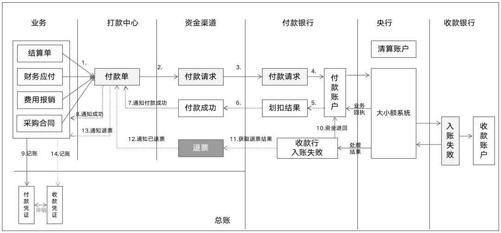

# 退票怎么处理

退票流程图：

## 支付成功两阶段

将付款划分两个阶段

- 第一阶段：“资金已付出”，即付款方成功扣除资金
- 第二阶段：“收款人已收款”，即收款方成功入账资金

只有这两个阶段都成功才是真正的支付成功。而第二个阶段容易失败，导致退票情况

## 支付成功的正确定义

> **注：不能将“付款成功”定义为“扣款成功” + “到账成功”**
> 
> - 一方面，企业的资金已经被扣除，必须正确记录付款凭证，否则会导致账实不符； 
> - 另一方面，收款人是否收到款项并没有明确的结果节点，我们不能一直等待。

因此，我们不如将这两个过程分开管理，而不是将它们耦合在一起。即先认为付款行的扣账成功是初步的成功，如果后续发生退票，再进行相应的处理。

银行也是采用这种处理方式。业务的处理成功仅代表资金已从企业账户提出，而非收款人已收到款项。如果资金未到账，该笔付款就处于资金在途的非终态，可能会发生退票。

参考：
https://mp.weixin.qq.com/s/uZl9C62CZGKdmz1Rn7FEGw