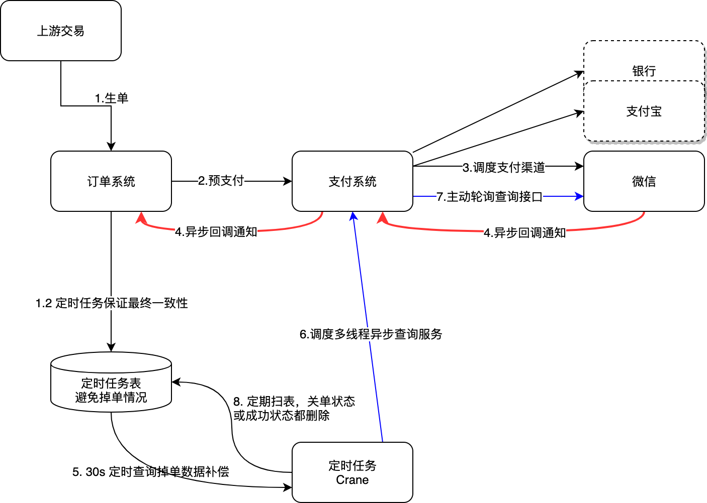
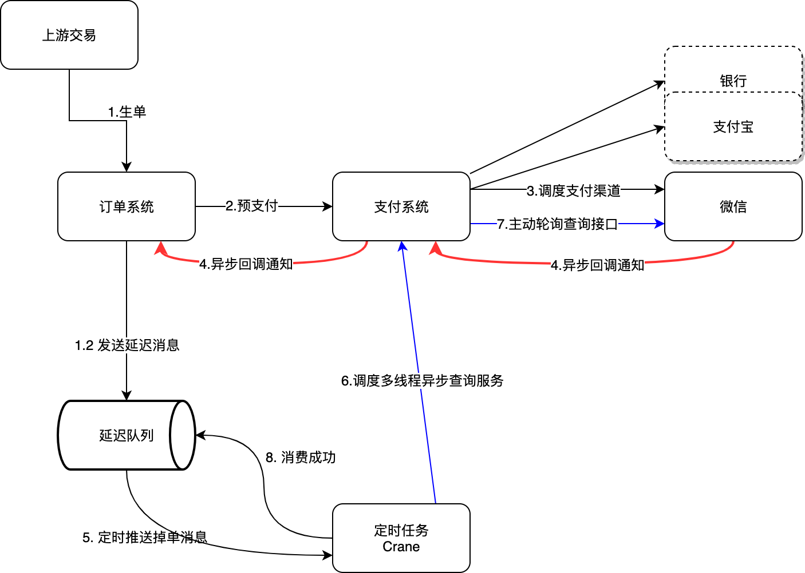
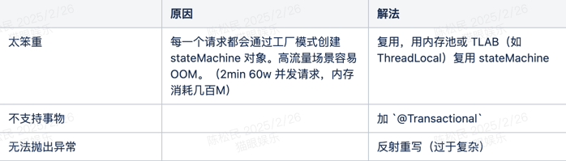

## 前言
订单系统是互联网公司常见的基石服务。基本上需要考虑的问题为： 
1. 如何控制订单状态流转（掉单问题如何解决） 
2. 如何应对日益增长的日单量级（存储层、单机请求承载上限） 
3. 子流程过多导致生单流程缓慢（性能问题）


## 掉单场景与解决
首先任何订单系统需要解决的一个系统异常就是掉单（丢单）场景。

一个正常的支付流程链路一般是：交易完成 数据流转到内部订单系统（或外部商户：京东、携程）-> 内部支付系统（或第三方支付公司：微信、支付宝）→ 微信渠道（或外部支付渠道：工行、农行）

掉单问题指的是外部支付渠道已经成功，但异步回调由于网络延迟波动或内部子系统由于各种原因导致的 status 更新失败。


通常来说掉单问题是通过异步补偿的方式解决的，常见的异步补偿有两种： 
- 定时轮询补偿 
- 延迟消息补偿


### 定时轮询补偿方案



如果掉单查询依旧还是处理中，那么经过一定的延时之后，重复第五步，再次重新掉单补偿，直到成功或者查询到达最大次数
任务终态（成功，关单）都直接删除，避免影响扫表速度
优点：简单易实施，基本上都是用定时任务执行本地消息表来实现最终一致性

缺点：定时任务天然弊端（消息堆积扫表慢，集中式扫表阻塞写逻辑，几率延迟执行）
1. 消息堆积扫表慢，要么给 status 加索引提升过滤比率，要么用多线程并发扫数据（需幂等控制，避免并发更新行数据、需线程隔离） 
2. 集中式扫表导致阻塞写操作（占用连接数，数据量大的话就退化成慢链接），所以一般扫表放在从库执行 
3. 几率延迟，就是多个定时任务同时执行导致串行（@Schedule 是单线程的，@Crane 是多线程的），所以一般都会同步转异步，或做延迟任务，https://www.cnblogs.com/jxxblogs/p/17021213.html


> 因为支付成功或支付回调都会更新定时表的支付状态，在后续的扫表中检查到 【支付状态成功，订单状态待支付】 的异常表单更新状态即可

> 为避免订单数据过大，查询定时任务表一般在备库进行，不影响主库的写性能

## 延迟消息补偿方案

本质借鉴了 rocketmq 事务消息流程中， broker 会定期重试回调生产者，通过调用检查本地事物是否执行成功的 api （默认6s，重试15次）
1. 若本地事物执行成功，提交 commit，half 半消息才成功显现能让消费者进行消费
2. 否则提交 unknown，broker 6s 后进行重试再检查

体现在订单系统，流程图如下：



第八步，如果第七步支付结果查询为以下状态：

- 支付结果为扣款成功 
- 支付结果为明确失败 
- 掉单记录查询达到最大次数 
- 补单程序将会告知延迟队列消费成功，延迟队列将会删除这条掉单消息。

其他状态将会告知消费失效，延迟队列将会在一定延时之后，再次发送掉单消息，然后继续重复第五步。

常见的延迟队列 redis set、kafka 时间轮算法、rocketmq

甚至基于 rocketmq 做延迟队列，可以用事务消息来控制是否取消订单（用户超时订单还未完成支付，rocket 事务消息提交，超时订单取消消费者接受到后执行流程）
- 强耦合 mq，其实不太现实

## 状态与状态流转
### 订单生命周期
订单生命周期的状态与状态流转一般如图所示：


也有一种做法将退款，支付等核心状态拆分出另外的单据来维护

虽然单据类型增多，但每个单据的状态量较少，不容易出错，流程也容易把控（但可能主流程状态和子流程状态之间的维护可能会出现并发问题）

### 状态控制与状态机
传统流程状态控制弊端：维护点分散导致不好维护、状态管理复杂、冗余的 if-else...


状态机进行流程状态控制：
spring 官方提供：spring statemachine；Squirrel（大流量更推荐）
它有四大核心部分：
- State ，状态。一个状态机至少要包含两个或以上的状态。状态与状态之间可以转换。 
- Event ，事件。事件就是执行状态转换的触发条件。 
- Action ，动作。事件发生以后要执行动作。 
- Transition ，变换。也就是从一个状态变化为另一个状态。

主要核心思想就是用 event 事件来代替传统 set 操作来维护管理状态变更，加上用全局唯一的状态机类来收拢状态变更的维护点

缺点：



状态机的核心类大概如下：

```java
public class StatusMachine<S extends BaseStatus, E extends BaseEvent> {

    private final Map<StatusEventPair<S, E>, S> statusEventMap = new HashMap<>();

    /**
     * 装配状态机，源状态接收事件后能抵达哪种目标状态
     * @param sourceStatus 源状态
     * @param event 对应事件
     * @param targetStatus 流转的目标状态
     */
    public void accept(S sourceStatus, E event, S targetStatus) {
        statusEventMap.put(new StatusEventPair<>(sourceStatus, event), targetStatus);
    }

    /**
     * 通过源状态和事件类型获取目标状态
     * @param sourceStatus 源状态
     * @param event 对应事件
     * @return targetStatus 流转的目标状态
     */
    public S getTargetStatus(S sourceStatus, E event) {
        return statusEventMap.get(new StatusEventPair<>(sourceStatus, event));
    }

}
```
- BaseStatus：状态基类，扩展定义状态枚举 
- BaseEvent：事件基类，用于控制状态流传的信息媒介，这点其实和 DDD 的事件领域驱动有异曲同工之妙 
- StatusEventPair：事件-状态对，将事件与状态进行绑定，一个状态可以绑定多个事件，即体现为一个状态经过不同的业务处理（事件通知）可以流转成不同的状态类型 
- statusEventMap：状态机，k：事件对，v：目标状态。维护原状态到目标状态的变换途径 
- 状态机两个核心功能： 
  - 接受 
  - 获取

### 存储优化
分库分表提升存储量与连接数
日千万级订单增量，应对措施为 主表扩增为 256 表。

### 如何支持多维度查询
为什么订单存储不适合市面上常见的存一份，再冗余一份到 es 做大宽表？

订单业务涉及支付、库存扣减等强一致性场景，而ES的写入延迟（通常为1秒内同步）可能导致冗余数据与源库的短暂不一致，引发订单状态错乱或重复扣款等问题‌。

es 是 OLAP，对写入和插入等操作实时性非常差。因此 es 一般存的是终态数据，不会轻易更改的，而订单的状态数据是经常需要变更的（订单生命周期状态流转）

因此美团的订单存储方案是冗余存储三份（主表 userId 分片，一份商家 id 分片，一份订单 id 分片，一份 es 做实时计算分析报表）

而阿里的订单存储方案只存一份数据，但在 mysql 存储引擎之上还设计了全局二级索引的概念（商家 id 与具体分片索引表，订单 id 与具体分片索引表）


### 冷热数据分离
为提升关系型数据库的读写性能，mysql 仅保留近三个月数据，其余历史数据冷存储到 hbase 磁盘中。若用户想搜索的是冷数据，直接会通过数据路由走到 hbase

但 hbase 海量数据存储的支持非常好，通过压缩机制能将数据压缩一半存储到磁盘里，但他压缩后的数据查询出来无顺序

- 美团解决方案：待调研 
- 阿里解决方案：自研 X-engine 和 polarDB 2.0


### 子流程过多导致生单流程缓慢
#### 同步转异步
非生单核心流程可以投递给 MQ 异步消费，如积分增加、库存扣减、短信通知等。订单系统只做生单主流程


#### 流程引擎实现编排与调度
通过对业务系统里的业务调用链路进行编排配置、定义流程和节点，然后业务流程编排框架会从配置文件（配置中心）里读取出业务调用链路和节点，接着业务流程编排框架会按流程顺序执行调用链路和节点。当业务调用链路出现故障需要补偿节点时，业务流程编排框架就会调用节点对应的补偿逻辑


#### 查询可以放在从库降低主DB压力
但这并不绝对，对于关键核心流程，比如订单状态修改变更与查询，都应该放在主库，避免主从延迟导致的状态错乱并发问题