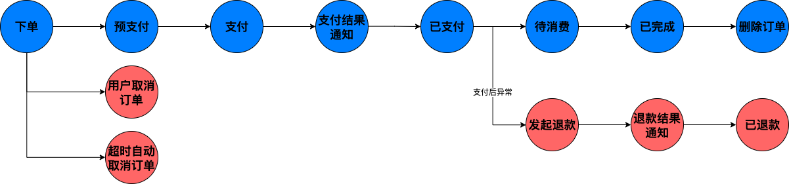
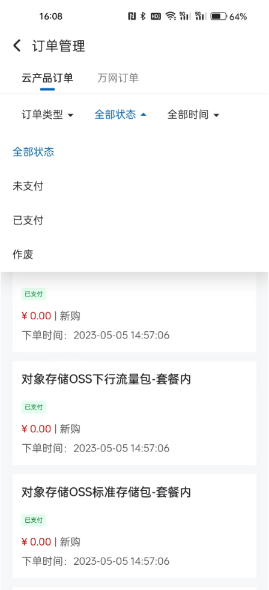

# 订单领域

## 订单信息

订单需要记录多个维度（领域）的核心信息。 可以根据业务模式的不同，再补充更多的辅助信息或冗余信息便于查询

- 购买者信息：记录谁买了商品； 
- 商家信息：说明商品是从哪里购买的； 
- 商品信息：详述购买了哪些商品； 
- 支付信息：记录支付方式和支付状态； 
- 对账信息：确认支付是否真实完成； 
- 物流信息：追踪商品是否已发货及物流状态； 
- 服务信息：记录是否提供了上门安装等服务； 
- 售后信息：反映客户是否有投诉及处理情况； 
- 退换货信息：处理商品破损或需更换的情况； 
- 订单日志：记录订单的整个处理流程；

这些信息并非存储在同一张数据表中，也不是简单的一对一关系。各类信息可能分散在多个数据表中，这些数据表之间存在着复杂的关联关系


## 订单生命周期

```text
下单 -> 预支付 -> 支付 -> 支付结果通知 -> 已支付 -> 待消费 -> 已完成 -> 删除订单
    ｜                                     |
    ｜-> 用户主动取消订单                     |_> 发起退款 -> 退款结果通知 -> 已退款 
    ｜_> 超时自动取消订单
```



## 拆单与父子单

当用户选择了多个商家的商品时（商品来源于不同的渠道，如自营与商家、商家与商家），订单会被拆分成多个对应商家的子订单。首次支付时，通常是对总订单进行支付（也就是常说的只会出现一笔支付流水）；若因故中断，后续支付则针对每个店铺的子订单进行。

此时，订单列表中会显示多个待支付的子订单，这是按照店铺维度进行的订单拆分。当然，也可以根据业务需求或其他模型对订单进行拆分。

影响订单拆分的主要因素包括：

- 不同商家：需单独结算，商家各自发货； 
- 不同发货仓库：如北京仓库、天津仓库等； 
- 品类包装要求：易碎品需特殊包装，大件与小件分开包装； 
- 物流因素：物流公司对包裹的体积和重量有特定要求； 
- 商品限价：如海购商品，海关有限价规定等。


订单拆分后，会形成父子订单的数据结构。以购买了2个商家的ABC三个商品为例，总价100元，平台优惠20元。其中，A商品属于店铺1，B商品属于店铺2。


当然，有些企业会将不同货仓的货物调拨到同一个仓库，这样就不用拆单了，但是会有调拨记录

## 订单类型

一个优秀的订单系统，不仅要高效处理自身的订单业务，还应当向上下游提供优质的订单服务。常见的订单服务如：

- 不同订单类型的创建服务
- 不同订单类型的状态变更实时通知服务
- 其他如补单、结算、订单分帐等增值服务

## 高拓展订单服务系统设计

现状：通常订单系统只考虑到眼前售卖产品，如售卖课程、售卖电影票、售卖xx商品等等。 往往都是基于数据库表设计的

这样有个弊端，就是后续如果要新增售卖的产品，就要修改数据库表结构，或者是重新开新表再做数据迁移。无论哪种方式，都会导致对现有数据部分表字段的缺失

目的：定制一个通用的订单系统（或叫业务中台），可扩展出任意种类的售卖产品

### 竞品分析：阿里云订单系统设计

#### 阿里云订单管理订单类型


- 新购
- 续费
- 升级
- 降级
- 补偿续费
- 退款
- 预留实例调整
- 磁盘扩容
- 转换
- 换购

#### 阿里云订单管理订单状态



- 未支付
- 已支付
- 作废

#### 阿里云订单管理订单详情与概览


参考阿里云的订单系统设计。

订单类型暂时扩展出四种：

```java
public enum OrderType implements BaseEnum<OrderType> {

    CHARGE(1, "充电"),
    PARK(2, "停车"),
    SHOP(3, "商城"),
//    MOVIE_TICKETS(4, "电影票"),
```

订单状态设计为三种：

```java
public enum OrderState implements BaseEnum<OrderState> {

    WAIT_PAY(1, "待支付"),
    PAY_SUCCESS(2, "支付完成"),
    ABANDON(3, "已废弃"),
```

对于业务数据，不同的订单除了订单类型不同，其实还暗含维度的概念。

- 如订单系统，可以包括status维度（成功、失败、待付款等等）、category维度（母婴、女装、男装等等）、source维度、chennel维度等等。

如图所示为：


这些维度标签过于灵活，因此在业务规模日益庞大下，为实现高扩展往往会采用 kv 存储

类 OrderBase 里的 attrs 字段

```java
    @FieldDesc(name = "订单附加信息")
    @Convert(converter = CodeValueListConverter.class)
    @Column(columnDefinition = "text")
    private List<CodeValue> attrs;

---
    
    @Data
    public class CodeValue {
    
        @FieldDesc(name = "key-键")
        private String k;
        @FieldDesc(name = "value-值")
        private String v;
        @FieldDesc(name = "level-标签")
        private String l;
    
    }

```

这样可以在业务 business 的基础上，还可以通过 tag 来对数据进行更细维度的区分，方便追更溯源

---

暂时写在这里

增减库存主要有两种主流的方式

1. 在用户下单时扣减库存：
   - 优点：用户体验良好，不会出现少卖现象
   - 缺点：会出现恶意下单或下单拒付等现象，锁库存导致少卖
   - 解决方法：
     1. 设置订单有效时间，若订单创建成功 N 分钟不付款，则订单超时自动取消，库存回滚
     2. 限购，在活动规则下限制买家最大购买件数，可在账号维度、ip维度进行购买数量的管控
     3. 风控，从技术角度层面，对恶意账号进行风控处理
2. 在用户付款时扣减库存：
   - 优点：减少无效订单带来的资源损耗
   - 缺点：若第三方支付返回结果存在时差，同一时间内多个用户并发同时付款成功，会导致下单数量超过库存，导致超卖问题
   - 解决方法：
     1. 付款前再次校验库存信息，如确认订单要付款时再进行一次校验，若库存不足则提示用户

两种方案各有优缺，一般会结合实际业务考量。 
通常来说，秒杀类、抢购、促销活动，由于库存较少，流量较大，会使用下单减库存方案，少卖现象可以容忍；
而对于产品库存数量较大，并发量没这么高的，会采用付款减库存方案。两者并无绝对优劣

参考：
https://mp.weixin.qq.com/s/bn6yDgnMzBuNThEWl-FlWA