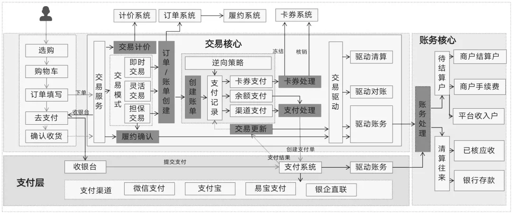
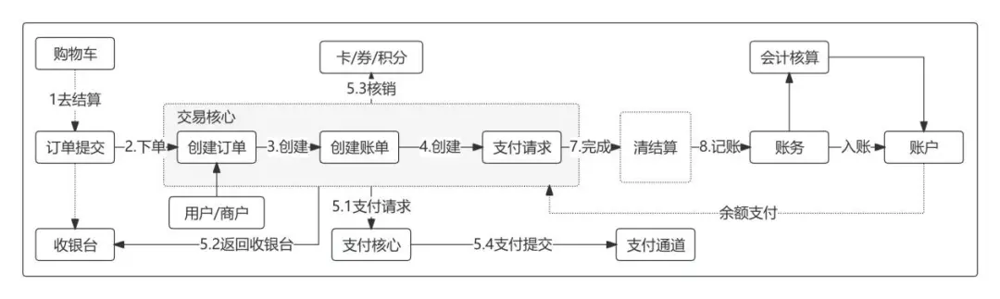

## 交易领域

### 交易核心流程一图流

交易流程各子系统交互概览

---

正向交易流程

> 用户选好商品 -> 商品加入购物车 -> 填写订单信息 -> 对订单进行支付 -> 等待服务履约

交易核心是根据账单支付记录，向各个微服务系统发起处理请求。

其中包括外部渠道的支付请求、内部系统的优惠卷、虚拟货币的核销处理以及积分的扣减一系列支付相关操作

### 逆向交易

#### 逆向处理方式

一个订单支付了100元，其中平台先分了10元（剩下的90元待分给商家）。此时发生了40元的退款，可以选择以下两种逆向处理方式：

方式一：按比例逆向退款。也就是平台的佣金按正向分账的比例逆向退回一部分。具体来说，平台分账退回4元，待分账给商家的90元中，逆向退回36元。

方式二：平台佣金不动，从待分账给商家的待结算金额里全额逆向退回40元。

#### 逆向场景以及处理

常见的逆向类型包括：

- 订单逆向
- 交易逆向
- 物流逆向
- 支付逆向
- 计价逆向

