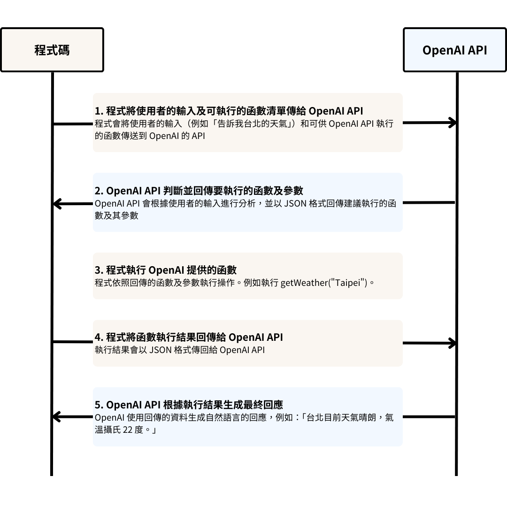

# MCP协议

MCP协议是由 Anthropic 提出的一种协议，允许 LLM 访问外部系统接口的能力。

LLM 只能用于推测文本内容，并不能接入我们的**本地数据**或者**系统API** 进行交互。

前者的解决办法是 RAG 搭建知识库（检索增强生成），后者则是本文的主题 MCP 协议。

在没有 MCP 的时代，我们想要让系统接入 AI 能力，只能通过 LLM 模型对外暴露的 HTTP 接口，传入 prompt + 上下文 进行调用。
得到的响应还是文本内容，无法直接使用，需要开发者定制一套通用协议手动进行转化。如 OpenAI 的 function calling。

以下为函式呼叫(function calling)的流程示意图：



MCP 采用 C/S 架构，用户询问大模型是 Client，外部资源服务、远程接口是 Server；

每个 LLM 产商都有各自不同的 FunctionCalling 协议实现，MCP 本质上只是将 Function Calling 的协议标准化

这里简单展示 OpenAI 和 Claude 两大厂商 function calling 各自的协议实现：

```json
{
  "index": 0,
  "message": {
    "role": "assistant",
    "content": null,
    "tool_calls": [
      {
        "name": "get_current_stock_price",
        "arguments": "{\n \"company\": \"AAPL\",\n \"format\": \"USD\"\n}"
      }
    ]
  },
  "finish_reason": "tool_calls"
}
```

```json
{
  "role": "assistant",
  "content": [
    {
      "type": "text",
      "text": "<thinking>To answer this question, I will: …</thinking>"
    },
    {
      "type": "tool_use",
      "id": "1xqaf90qw9g0",
      "name": "get_current_stock_price",
      "input": {"company": "AAPL", "format": "USD"}
    }
  ]
}
```

MCP将不同的协议统一化，可以理解他是迭代器 Adapter，屏蔽了不同协议之间的差异。

```json
{
  "json-rpc": "2.0",
  "id": 129,
  "method": "tools/call",
  "params": {
    "name": "get_current_stock_price",
    "arguments": {
      "company": "AAPL",
      "format": "USD"
    }
  }
}
```

应用充当中介，将输出转换为与 MCP 兼容的请求。然后，MCP 确保函数调用正确执行，并将结构化结果发送回 LLM

客户端需要配置远程接口地址，当询问大模型 LLM 时，其会根据询问内容判断决定是否要调用远程接口或访问外部资源服务（在这一过程会进行询问）

> 注意：LLM 无法主动调用远程接口或访问外部资源服务：具体能否访问还得用户授权；具体能否触发还得看 LLM 智力判断（但目前 LLM 已展示出不错的判断力，比人判断准确）
>
> 远程接口地址也不一定非得硬编码在客户端，也可将服务远程注册到注册中心维护，客户端定期拉取更新。

函数调用和 MCP 并不是对立的关系，二者相辅相成；函数调用将提示转换为结构化指令，而 MCP 执行这些指令，确保无缝的 AI 集成。

参考文章：
- [Function Calling是个啥?](https://www.explainthis.io/zh-hans/ai/function-calling)
- [MCP概念介绍](https://www.anthropic.com/news/model-context-protocol)
- [MCP协议内容](https://modelcontextprotocol.io/introduction)
- [MCP协议介绍](https://zhuanlan.zhihu.com/p/27327515233)
- [FunctionCalling.vs.ModelContextProtocol](https://dev.to/fotiecodes/function-calling-vs-model-context-protocol-mcp-what-you-need-to-know-4nbo)