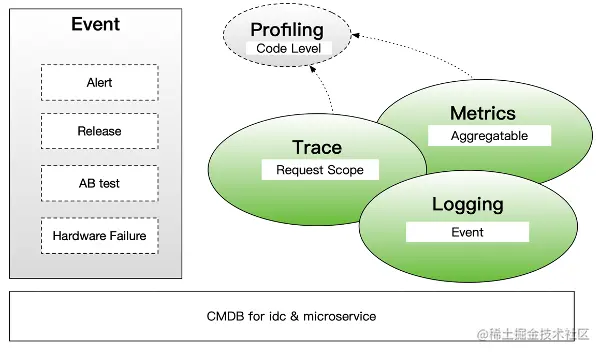
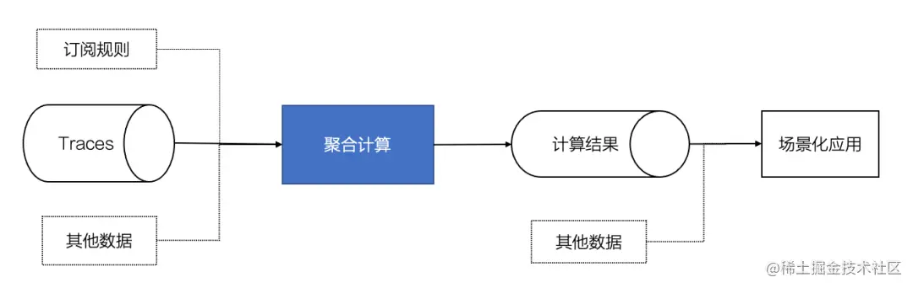
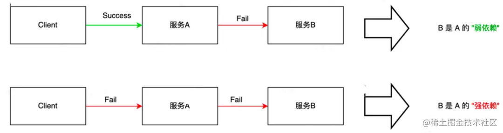
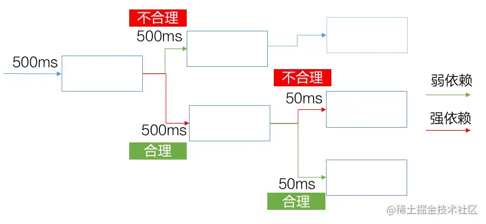
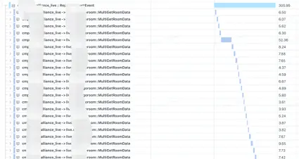

# 服务治理

## 可观测性

随着微服务架构的快速发展，软件系统正在从单体应用发展为由大量微服务节点构成的复杂应用。为了更好的管控复杂的软件系统，
“可观测性”工具正在变得越来越重要。“可观测性”工具构建的基础是可观测性数据，可观测性数据一般包括如下部分：
- 链路追踪(Trace)
- 日志(Logging)
- 指标/时序(Metrics)
- 代码栈(Profiling)
- 事件(Event)
- 元数据(CMDB)

他们之间的关系如下图所示：

一个直观的案例如下：某值班人员收到告警通知[Event]服务的失败率[Metrics]正在上升，
点击关联到错误指标对应的Trace[Trace]，在 Trace 中定位到错误的源头，在源头查看到关键的异常日志[Logging]和代码栈[Profiling]，
并发现源头报错服务正在执行一个变更操作[CMDB]，于是基本定位到此变更很可能就是导致此故障的原因。

## 链路分析

Trace 的高级应用：
对 Trace 的印象可能是通过 TraceID 或者某些 Tag 检索出一条或者一些 Trace，
然后从 Trace 数据中仔细查看明细的调用轨迹和各种 Tag 来分析一些具体问题，比如一个请求为什么慢，或者一个请求为什么出错了。

但面对一个不断变化的复杂微服务系统，我们将面对一些更高层次的东西：
- **稳定性**： 紧急状况时，哪些服务可以被降级，哪些服务必须被保障？高风险的易故障点在哪里？
- **流量/容量**： 如果某页面的 PV 要增加10倍，哪些服务需要扩容？需要扩容多少？
- **成本性能**： 哪里存在明显的性能反模式？哪里存在架构不合理带来的性能浪费？

这些问题的答案靠人工去一条一条看 Trace 难以得到可靠结果。但是却可以从大量的 Trace 数据中自动化地计算出来，
为最终决策提供可靠的数据支持。我们把这种对大量 Trace 的聚合计算叫做 链路分析。

### 基本原理

链路分析的基本原理就是对大量的 Trace 进行聚合计算，一般遵循 MapReduce 计算模型，
过程中可能会结合一些订阅规则和其他数据，得到计算结果，然后应用到具体的场景化应用中去。

### 技术架构

适合对大量链路数据进行聚合计算的可选模式主要有三种，
分别是从基于在线数据流的流式计算、从在线存储中查询有限条 Trace 然后进行的即兴（抽样）计算，以及基于离线数仓的离线计算。

三种计算方式的优缺点如下方表格所示：

| 计算方案       | 优点                         | 缺点                                                                                     |
|----------------|----------------------------|------------------------------------------------------------------------------------------|
| 流式计算       | - 近实时的分析结果                 | - 无法对任意时段任意条件的数据进行计算                                                   |
|                | - 数据完整性和准确度较高              | - 受数据流量波动影响，维护成本相对较高                                                  |
|                | - 多机房部署升级较为方便（自研未依赖 flink） |                                                                                          |
| 即兴（抽样）计算 | - 可对任意时段任意条件的数据发起分析并快速获取结果 | - 只能对抽样的有限条 Trace 进行计算，数据完整性较低                                      |
|                | - 最低的额外机器成本和运维成本           |                                                                                          |
| 离线计算       | - 数据完整性和准确度高               | - 小时级或天级的延迟的分析结果                                                          |
|                | - 稳定，机器成本和运维成本较低           | - 对大数据套件依赖较重，多区域的部署和升级成本较高                                      |

三种计算方式的适用场景如下方表格所示：

| 需求类型       | 描述                                   | 此类需求高的场景举例 | 合适的计算方案         |
|----------------|--------------------------------------|------------------|--------------------|
| 实时性需求      | 需要分析最新的数据吗还是可以接受一定的延迟？ | 故障归因           | 即兴计算/流式计算      |
| 数据完整性需求   | 抽样一部分数据计算能否满足需求？还是必须对所有 Trace 计算才能得到结果？ | 流量估算           | 离线计算/流式计算      |
| 需求即兴程度    | 任务是即兴发起且必须快速拿到结果的吗？     | 故障归因           | 即兴计算            |

## 强弱依赖

强弱依赖信息是服务稳定性治理场景的重要数据支撑，它也是可以通过线上的 Trace 数据自动化地计算出来的。
- 强依赖：异常发生时，影响核心业务流程，影响系统可用性的依赖称作强依赖。
- 弱依赖：异常发生时，不影响核心业务流程，不影响系统可用性的依赖称作弱依赖。

简单来讲，服务A需要借助服务B的功能完成业务逻辑，则称为服务A依赖于服务B。
当B挂掉的时候会影响A系统核心业务流程的执行、影响系统的可用性，这就是“强依赖”。反之为"弱依赖"

强弱依赖计算的技术目标包括：
- 准确性： 尽可能高，尤其是减少“强误判弱”，提供判定依据样本
- 覆盖度： 尽可能高，尽可能多的为线上存在的调用关系给出强弱依赖数据
- 粒度： <调用方服务接口,被调方服务接口>、<场景,调用方服务接口,被调方服务接口>
- 实时性：nice to have

通常对强弱依赖的分析是基于实时流式计算，从数据流中选择带 Error 的 Trace 进行强弱依赖关系计算。
需要注意短期的实时数据样本往往不够，需要结合历史累积数据共同判定再下结论。

强弱依赖分析的主要挑战:
- 准确率：不同业务线判定业务稳态的规则较难统一，需要推动业务完善数据标记或规则录入。
- 覆盖率：部分路径线上常态化错误率极低，较难收集到足够的错误样本，需要配合混沌演练进行补充。

强弱依赖分析的主要应用场景包括：
- 限流降级预案配置指导：强弱依赖数据可以回答紧急状况时哪些服务可以被降级，哪些服务必须被保障的问题。
  弱依赖可以进行限流降级，而强依赖则应当尽可能的保障高可用。
- 超时漏斗配置指导：强弱依赖数据可以指导业务更合理的配置超时漏斗。如下图所示，弱依赖配置超时时间过长是不合理的，可能会导致不必要的慢请求；
  如果强依赖配置的超时时间过短也是不合理的，可能会导致不必要的失败请求影响用户体验。

  

- 辅助自动化故障归因：  准确的强弱依赖信息，对自动化故障归因可以起到较好的辅助作用。
- 服务架构治理：  准确的强弱依赖信息，可以协助业务优化架构，治理不符合预期的强依赖，提前准备灾备方案，提升整体的稳定性和高可用。

## 全链路性能反模式分析

对于一些非常典型的性能反模式问题是可以从 Trace 数据中自动化的计算发掘，常见的性能反模式包括：
- 调用放大：单请求中，大量调用同一服务接口。如果在线链路中出现了调用放大比例极高的 case，
  往往不仅暴露出性能问题，还很可能会造成稳定性风险，需要及早治理掉。
- 重复调用：单请求中，多处使用相同 Request 调用同一个服务接口。这种情况常见于基础信息的重复获取，
  例如多处重复去请求 user info 或者 device info，是可以进行优化的。
- 读写放大：单请求中，从底层服务获取的数据量远大于最终返回给client的数据量。这种情况常见于滥用重接口获取轻信息，
  例如调用重接口请求了 user 的所有信息，却只取了 user name 一个字段。
- 串行循环：串行循环特征较为明显，其形态一般如下图所示，一般可优化为并行或批量调用。

参考：
- https://zhuanlan.zhihu.com/p/670135136
- [大规模分布式链路分析计算在字节跳动的实践](https://juejin.cn/post/7163159771745353741)