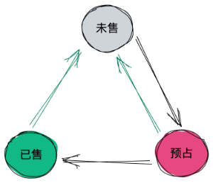
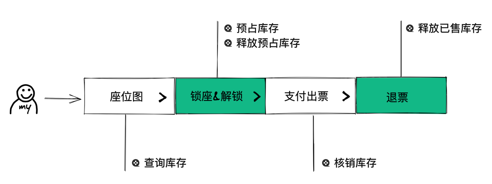
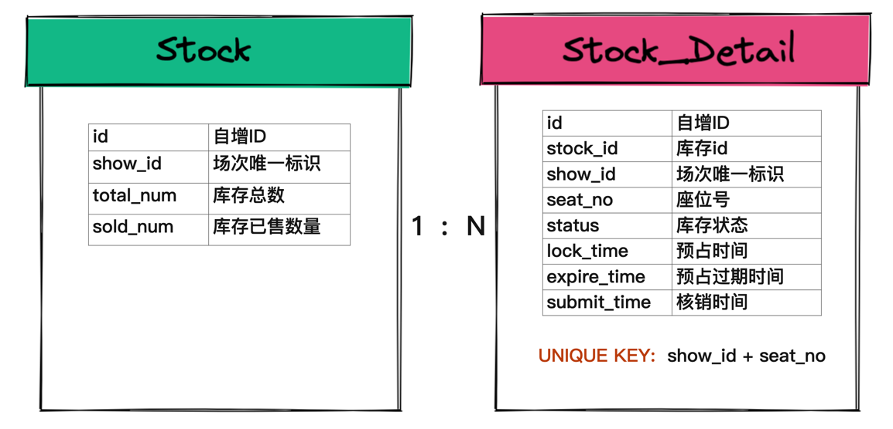
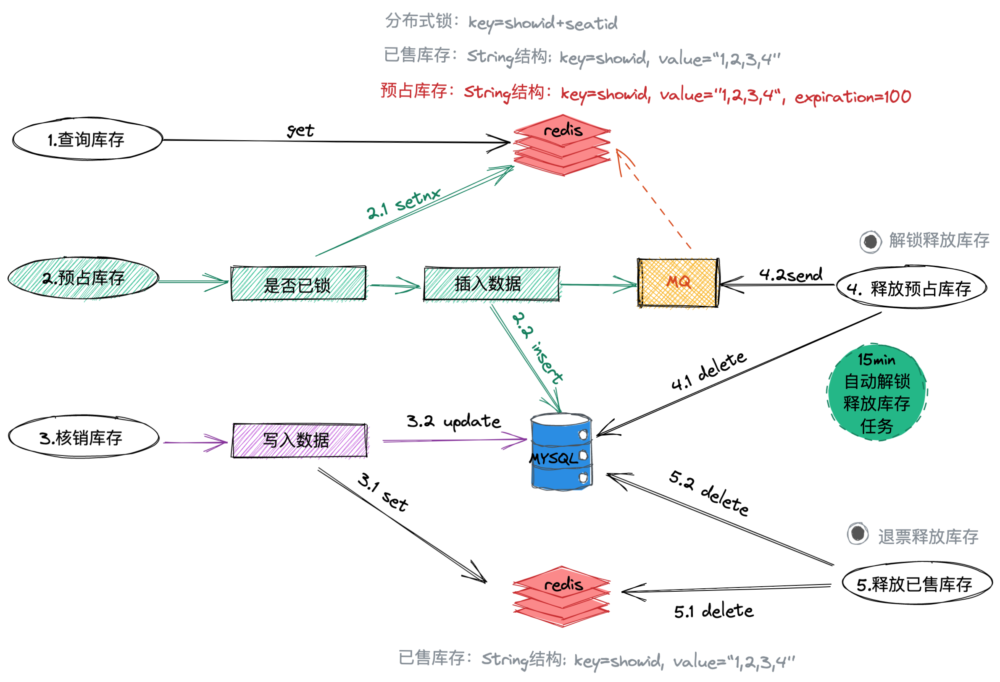
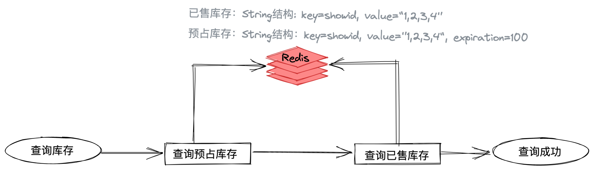
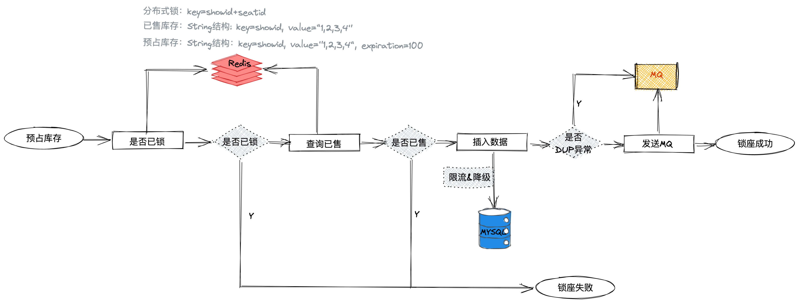
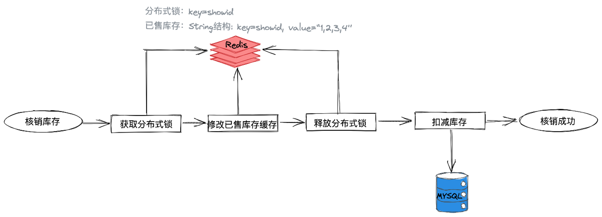
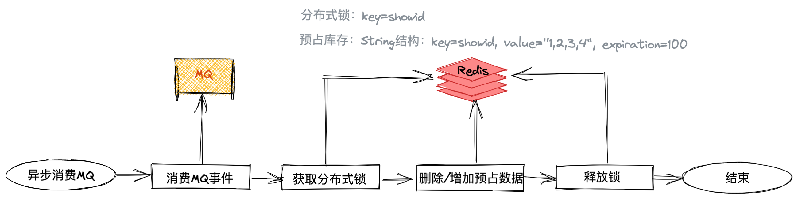

# 在线选座库存系统三高设计

## 背景

在线选座的库存与传统电商不同

- 传统商品库存：多为数字库存，即有很多商品货物，秒杀或平时选购往往只是将库存普通的当做一个数字进行扣减，
这种场景直接将库存数字在 redis 预热做扣减就行，非常简单
- 在线选座库存：由于库存是电影场的一个个座位，每个座位都具有唯一性，抢过了就不能再抢（除非释放库存）。
而且抢过了之后需要实时展示给用户，避免已占库存用户无感知依然去抢购导致频繁的失败

从这两段描述中我们可以看出：商品库存只是简单的库存数字扣减，而在线选座库存需要具备一座一票和实时性等特性（更细粒度化）

## 库存生命周期流转



枚举：
```java
public enum SeatStockType implements BaseEnum<SeatStockType> {

    STOCK_LOCK(1, "库存已锁"),
    STOCK_KEEP(2, "库存可选"),
    STOCK_SOLD(3, "库存已售"),
    ;
}
```

库存业务功能状态流转: 



1. 通过座位图查询库存
2. 锁座 -> 预占库存 & 解锁 -> 释放预占库存
3. 支付出票 -> 核销库存，占用变为已售
4. 退票 -> 释放已售库存重新流转回待售

从流转可以看出在线选座库存的基本能力为：查询、占用、核销、释放

## 四大功能面临的技术难点与挑战

1. 查询库存：实时性高，流量大
   - 引入缓存抗压，锁座解锁双写缓存与DB
2. 预占库存：高并发，流量大
   - 座位 Seat 维度的分布式锁，避免流量直接抵达DB
   - DB唯一索引 + 乐观锁，最后兜底避免重卖
3. 释放库存：一致性（DB与缓存的数据一致性），操作原子性
   - 如果释放库存后缓存没数据，但DB依然有数据；其他用户会抢座，后被DB重复key拦截。影响用户体验
   - 如果释放库存后DB没数据，但缓存依然有数据；其他用户看到座位依然被占，但实际库存已释放，导致少卖现象
4. 核销库存：数据一致性
   - 核销在交易流程结束后，此时流量已经没有这么大，且核销需要调用上游的交易方（或下游的履约）进行出票，
   因此如果出票失败，需要依赖交易业务方的重试

## 存储结构选型

### DB 存储结构

为了实现一票一座。可以设计两张表，stock 和 stock_detail，分别是座位库存总表和库存明细表，关系为 1:N



其中 stock_detail 的 uk(show_id, seat_no)，以场次和座位编号来确定唯一座位

### redis 存储结构

查询需要支撑 20w qps。需要保证操作缓存的原子性

- set：<key, {1,2,3,4}>
  - 优点：保证修改操作的原子性，remove 和 add 天然原子
  - 缺点：获取集合 Smembers 的时间复杂度是 O(N)，无法抗住 20w qps
- string：<key, "1,2,3,4">
  - 优点：set/get 操作是 O(1)，性能很高
  - 缺点：修改非原子性，如果要释放某一个场次的库存，需要 get 得到集合，内存中进行计算，再序列化 set 回 string

string 满足我们的查询性能，但修改不原子，原子操作的话要么用 lua 脚本，要么就是直接加锁处理。

但使用 lua 脚本有个前提，就是尽量避免在 lua 中使用过多的 cpu 计算，不然会阻塞 redis，拖慢 redis 读写能力（redis 单线程）

因此决定加锁处理，但由于预占库存实际也是个高并发操作，同步地直接加锁对于接口性能的拖累是不可容忍的，
故采用 mq 异步加锁的方式来保证 string 数据架构的修改原子性

## 架构设计


 
1. 查询库存：get 获取 redis string 架构，O1 时间复杂度。
2. 预占库存： 
   1. seatNo 维度的分布式锁 setNx，查看当前选座是否被锁 
   2. 库存流水表插入数据 
   3. 通过 mq 异步更新座位图缓存，showId 维度的粗粒度分布式锁。
3. 核销库存：先写 redis 后写 DB（其实顺序已经不重要了，核销的流量已经非常少，即使有错直接让业务方重试就行，反正是预占库存变已售库存状态，不会被其他用户抢占）
4. 释放预占库存（超时解锁，手动取消）：15min 定时任务执行 + 预占缓存超时过期 
   1. 先删预占库存分布式锁 
   2. 再删 DB 流水明细表 
   3. 再发送 MQ 更新座位图缓存
5. 释放已售库存（退款）：先删 redis 再删 DB

## 业务功能描述

- 查询库存: redis采用String结构存储，通过场次ID从缓存中分别获取已售库存和预占库存信息，结合静态座位图信息可获取场次座位图库存的全部信息。



- 预占库存：通过(场次ID+座位ID)分布式锁（无时效，通过释放已售库存保证得到释放？）来保障一个座位只有一个用户预占，锁座成功后插入库存流水表座位状态为预占，
如果出现DuplicateKeyException异常这发送MQ更新缓存预占库存,无异常发送MQ更新缓存预占库存。



- 核销库存：获取已售场次锁，操作缓存增加已售库存，修改数据库库存流水的状态为已售，同时修改库存主表的已售库存数，由上游交易出票业务重试保证数据最终一致性。



- 释放已售库存：先删除分布式锁，然后同步删除缓存已售库存，再删除数据库的库存流水，由上游交易退票业务重试达到数据最终一致性。


- MQ异步预占库存或释放预占库存：从MQ中接收库存事件，获取预占场次锁，操作缓存新增或删除预占库存，释放锁，
每次异步更新座位图需要对缓存进行setNX→get→set→del 4次操作，假如按10ms来计算，一个普通场次有200个座位，在秒杀最极端的情况所有座位图同时被锁，
更新的耗时是200*10ms=2s，如果第201个用户锁座失败，用户2s后刷新座位图后能够马上看到该场次所有座位售罄的状态。



## 设计细节

### 高性能设计方案

- 高并发原子性:  需要2次redis查询，对20W的QPS压力不大，原子性操作通过异步MQ解决。

- 实时性：异步更新座位图需要对缓存setNX→get→set→del 4次操作，假如按10ms来计算， 一个普通场次有200个座位，
在秒杀最极端的情况下，所有座位图同时被锁的耗时是200*10ms=2s，结合用户体验的优化可以接受。

- 时序性：通过预占库存和已售库存缓存分离，预占缓存自动失效机制解决了时序错乱带来的少卖问题。

- 一致性：DB和缓存可以做到最终一致性。

### 为什么需要 MQ 异步更新座位图缓存

锁座请求失败后，需要通过 mysql 座位明细表（流水表）反查这一批锁座编号里具体哪些座位被售卖，通过 mq 异步补偿给座位图缓存

> 为什么用 mq？因为 redis 售座缓存结构使用了 String，修改操作非原子，采用 mq 异步加锁的方式以原子粒度更新缓存

### 为什么更新座位图缓存要加 showId 维度的粗粒度分布式锁？

为什么不做更细粒度的 seatNo 维度分布式锁？粗粒度并发场景下不会导致大量的流量被阻塞吗？

### 为什么座位图缓存拆分成已售库存和预占库存？

缓存中库存信息拆分成已售库存和预占库存2个key

- 新增和删除缓存的已售库存都是同步操作BD和缓存，依赖上游交易出票和退票业务的同步机制来保障最终一致性
- 预占库存缓存设置了失效时间，预占库存缓存的添加和删除依赖消费Queue异步操作

当出现数据不一致，类似预占库存缓存多了数据，会有缓存失效来保障最终的一致性，避免出现上面的少卖的情况

但预占库存缓存存的是该场次的所有预占库存信息，如果失效会导致所有预占态库存都失效，也就会影响到座位图的准确性。 

> 比如说某场次8点开启秒杀，但场次预占库存缓存的失效时间是8点05秒，8点05锁座成功的座位在出票中，
> 
> 此时缓存失效了，导致后面进来的用户看到该座位一直是未售状态，但一直锁座不成功，只有等出票完成后才看到座位图变成已售状态，严重影响了座位图的实时和准确性。

针对这种情况系统对预占缓存引入了续签操作，每次有锁座请求都会将预占缓存的失效时间重新设为N分钟，这保障了座位图在流量高峰区的实时性和准确性， 但预占库存缓存的不一致还是会出现在某些极端情况下。

- 当预占缓存设置N分钟失效，某个用户在开场前N分钟内购票后解锁，此时系统出现一致性问题，缓存在场次放映后才失效，就会导致这个座位无法售卖（少卖）。 
- 在低峰期，如果用户A预占了某个库存，N分钟后预占库存的缓存失效了，用户B就会看到这个座位是未售，但B锁座会失败，因为数据库这个座位是预占状态，
**这种情况可以通过捕抓DuplicateKeyException更新缓存数据来优化**。

第一种场景的不一致需要我们合理的设置缓存失效时间，那么如何设置失效时间N？

- 针对开场前N分钟会出现少卖的场景，想要影响越小，N设置越小越好；
- 如果N设置太小会频繁出现用户看到座位可售但实际无法锁座的场景，伤害用户体验；

需要在2者之间权衡，可以参考平均支付时长做设置，N设置为5min。

## 技术挑战

一个人可能一次购买多次座位（亲友团），抢座需要分布式锁将并发操作串行化。

三个问题：
- redis 宕机怎么处理？
- 批量分布式锁如果失败要全部回滚，但如果回滚失败怎么观察与控制？
- 并发场景下，多个请求的锁座出现交集，是否会导致死锁？

### 如何避免交集锁座出现死锁问题？

详细阐述一下第三点：先说结论，**通过对锁座请求先强制排序来避免死锁问题**

用户A‌和‌用户B‌同时抢购座位，分别需要锁定座位 B2 和 A1
- ‌未排序时‌，两个线程的锁获取顺序可能如下： 
  - 用户A的线程按 B2 → A1 顺序尝试加锁 
  - 用户B的线程按 A1 → B2 顺序尝试加锁 
  - > 结果‌：用户A先锁住 B2，用户B先锁住 A1，双方均无法获取对方持有的锁，导致‌死锁‌‌。
- 排序后的处理： 对座位号按字典序排序后，所有线程统一按 A1 → B2 顺序加锁 
  - 用户A的线程‌：先锁 A1（失败，已被用户B锁定）→ 终止操作 
  - 用户B的线程‌：先锁 A1（成功）→ 再锁 B2（成功）→ 完成抢座 
  - > 结果‌：用户B成功，用户A快速失败，‌避免死锁‌。

即：排序保证全局锁顺序一致性‌——所有线程按相同顺序获取锁，打破交叉等待的潜在死锁条件‌。（类似数据库事务中按主键顺序加行锁的机制‌）；
从而减少无序锁请求的风险‌——若未排序，高并发下多个线程可能形成环形依赖（如用户A等用户B的锁，用户B等用户A的锁），导致系统卡死‌

### 批量申请分布式锁失败后回滚也失败如何处理？

- 简单设计：啥也不做，依赖缓存超时自动过期来释放库存的最终一致性来做；
但导致的后果就是秒杀场景可能出现大量少卖（大量的并发资源竞争可能导致一些库存被锁住无法释放）

- 复杂设计：引入 MQ 消息队列，在解锁失败后将 seatNo + showId 记录到失败队列周期性重试，也是常见做法；
缺点就是复杂度升高，需要保证 MQ 的可靠性

### redis 宕机怎么处理？

多主多从架构保证 redis 的高可用？

#### 高可用架构与配置预防

1. 部署哨兵机制（Sentinel）实现自动故障转移‌ 
   - 主节点宕机时，哨兵自动选举从节点晋升为主节点，保障服务连续性‌。配置至少3个哨兵节点‌，避免误判导致的脑裂问题‌。
2. 采用 Redis Cluster 分片集群‌ 
   - 数据分片存储，单节点宕机仅影响局部数据，其他分片正常服务‌。支持主从自动切换‌，结合槽位迁移实现容灾‌。
3. 数据持久化双保险‌ 
   - 同时启用 RDB（定时快照）‌ 和 AOF（实时日志）‌ 持久化机制‌。 
   - AOF 配置为 appendfsync everysec，平衡性能与数据安全性‌。
4. 多级缓存降级‌ 
   - 在 Redis 上层叠加 ‌本地缓存‌（如 Caffeine），Redis 宕机时短暂依赖本地缓存‌。 
   - 通过配置中心动态切换缓存源，降低强依赖风险‌

#### 宕机后快速流量切换

哨兵机制监控节点健康，一旦节点宕机快速摘除故障节点（部分流量在切换中间态的丢失怎么解决）

#### 服务降级与熔断‌

触发熔断规则（如连续 5 次 Redis 调用超时），暂时屏蔽非核心功能‌。返回兜底数据或静态页面，避免服务雪崩。

#### 恢复后的数据同步与验证

‌全量数据校验‌：
- 使用 redis-cli --cluster check 命令检查集群数据一致性‌。 
- 对比主从节点的 INFO replication 输出，确认同步偏移量一致‌。（主从切换这种场景解决不了？）

‌增量数据补偿‌： 
- 从消息队列（如 Kafka）中重放宕机期间未处理的写请求‌。
- 通过 Binlog 监听‌ 补全缺失数据（需结合数据库协同设计）‌

### 主从延迟怎么解决？

写 DB 的操作为预占库存写库存明细流水表。在读 DB 过程中出现主从延迟，通常有两种解决方案：

1. 强制读主，从库仅作备份与主从切换备库（但无法解决写主后还未来得及同步给从库，主库就挂掉了所引发的数据丢失）
2. 双写 DB 和缓存，写流水表到 DB 后，同步再写一份到 redis 里（但不要影响主逻辑执行，catch 异常）
即使极端情况下会造成的一些数据不一致也可以容忍，因为库存明细已经写入主 DB 了，并发来的写请求会被数据库重复key拦截

## 压测报告

- 动态座位图的平均更新时间为：6ms/座位

| 接口名称       | QPS（次/秒） | 压测方法                      | 关键影响因素                     |  
|----------------|-------------|-----------------------------|--------------------------------|
| **查询库存** | 200,000     | 混合读写压测，分布式缓存优化         | 缓存命中率、网络带宽、集群分片策略      |  
| **预占库存** | 100,000     | 分布式锁（Redis）高频请求模拟       | 锁竞争频率、原子操作性能、锁过期策略     |  
| **核销库存** | 2,000       | 事务型操作压测（低并发高一致性）      | 数据库事务隔离级别、索引优化、日志写入速度 |  
| **释放库存** | 1,000       | 异步队列处理模拟（延迟敏感场景）       | 队列堆积处理能力、失败重试机制          |  

